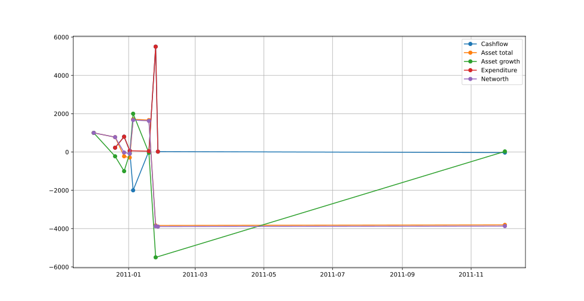

Python scripts that provide extra functionality to interact with
[ledger](https://www.ledger-cli.org/) files.

# `ledger_plot.py`

Visualise ledger files as a graph.



# `crypto_prices.py`

Get cryptocurrency price history from [CoinGecko](https://www.coingecko.com).

```
$ python crypto_prices.py -d 2022-07-02 monero eur XMR '€'
P 2022-06-25 XMR 120.59731045346565 €
P 2022-06-26 XMR 120.90838019189003 €
P 2022-06-27 XMR 119.27891362461713 €
P 2022-06-28 XMR 115.06980897095315 €
P 2022-06-29 XMR 111.69391683307406 €
P 2022-06-30 XMR 113.71224013540633 €
P 2022-07-01 XMR 106.59591410084337 €
P 2022-07-02 XMR 110.96709592437107 €
P 2022-07-03 XMR 111.41936344312975 €
P 2022-07-04 XMR 111.60604317047834 €
P 2022-07-05 XMR 118.95547848466549 €
P 2022-07-06 XMR 119.07229136993973 €
P 2022-07-07 XMR 123.59649779923349 €
P 2022-07-08 XMR 128.46515069673248 €
P 2022-07-09 XMR 124.70590932856993 €
```

# Usage

Run the scripts with the `-h` flag to view detailed usage information.

```bash
python ledger_plot.py -h
```

# Requirements

* Matplotlib
